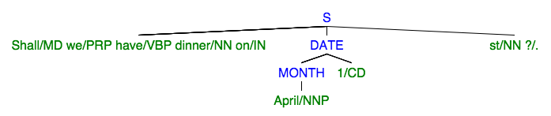

# POS Chunker

[](https://app.wercker.com/project/bykey/fe97fb8ffc1767d6f8ca9a69b5d1022a)

A parts-of-speech (POS) chunker. The purpose of this is to take output from a POS tagger -- which adds a part-of-speech tag such as 'noun' or 'verb' to each word in a string -- and group words together to form phrases. Output is in the form of labelled bracket notation.

The module aims to provide the kind of functionality found in [NLTK's `chunk()`](http://www.nltk.org/_modules/nltk/chunk.html) or [Stanford's `TokensRegex()`](http://nlp.stanford.edu/nlp/javadoc/javanlp/edu/stanford/nlp/ling/tokensregex/SequenceMatchRules.html) methods. Since the NLTK syntax is less powerful (it only supports matching tags, not matching words or chunks), we've opted to try to emulate the Stanford approach.

All examples assume:

```
var chunker = require('pos-chunker');
```

Also note that `POS Chunker` assumes that its input has already been chunked as part of some processing pipeline, using something like [pos](https://www.npmjs.com/package/pos). 

## Illustration

To illustrate the purpose of a chunker, imagine we want to find dates within a sentence like the following:

```
Shall we have dinner on April 1st?
```

We could just write regular expressions to find sequences such as `April, 1st`, but they will quickly become unwieldy as we look for more and more parts of a date (days of the week, years, seasons, phrases such as 'next Friday', and so on).

However, if instead of processing the raw string we process the output of a POS tagger then we can write simpler rules yet deal with greater complexity. By creating simpler rules we'll have a much better chance of understanding and maintaining them.

To continue the illustration, a POS tagger might produce the following output after processing the example:

```
Shall/MD we/PRP have/VBP dinner/NN on/IN April/NNP 1/CD st/NN ?/.
```

In order to process this string we could write a rule that adds an annotation whenever a month is found:

```
[ { word:/January|February|March|April|May.../ } ] => MONTH
```

We could then write another rule that says if we find a month that is followed by a number, add another annotation to indicate we have a date:

```
[ { chunk:MONTH } ] [ { tag:CD } ] => DATE
```

The output after the first rule would be:

```
Shall/MD we/PRP have/VBP dinner/NN on/IN [MONTH April/NNP] 1/CD st/NN ?/.
```

and after the second:

```
Shall/MD we/PRP have/VBP dinner/NN on/IN [DATE [MONTH April/NNP] 1/CD] st/NN ?/.
```

## Rules

The rules syntax is based on [Stanford's `TokensRegex()`](http://nlp.stanford.edu/nlp/javadoc/javanlp/edu/stanford/nlp/ling/tokensregex/SequenceMatchRules.html), which allows matches against words, tags and previously encoded chunks.

### Words

A word is the first part of a POS tag, up to the slash. For example, in:

    Shall/MD we/PRP have/VBP dinner/NN ?/.

the words would be *Shall*, *we*, *have*, *dinner* and *?*. We can write a rule to match words in a variety of ways. If we want to match each word, regardless of its tag, we write:

    [ { word:.*? } ]

or:

    [ { word:/.*?/ } ]

To match a literal we just add the literal after the colon:

    [ { word:dinner } ]

or:

    [ { word:"dinner" } ]

The slashes and quotes are optional, but in some situations might make things a little clearer to read.

The part after `word:` is just a regular expression, so all of the following are valid:

```
[ { word:[Ss]hall } ]
[ { word:we|have } ]
[ { word:have } ] [ { word:/dinner|lunch/ } ]
```

The first will match the word *Shall* or *shall*:

    {Shall/MD} we/PRP have/VBP dinner/NN ?/.

the second will match the words *we* or *have*:

    Shall/MD {we/PRP} {have/VBP} dinner/NN ?/.

and the third will match the word *have*, followed by either the word *dinner* or *lunch*.

    Shall/MD we/PRP {have/VBP dinner/NN} ?/.

Note that we can also change the last rule to use lookahead; we can match *have* when it is followed by *dinner* or *lunch*, but only capture the verb:

```
[ { word:have } ] (?=[ { word:/dinner|lunch/ } ])
// Shall/MD we/PRP {have/VBP} dinner/NN ?/.
```

The spaces within the expressions are not relevant, so the previous example could also be written in any of the following ways:

```
[{ word:have }] (?=[{ word:/dinner|lunch/ }])
[{ word:have }](?=[{ word:/dinner|lunch/ }])
[{word:have}](?=[{word:/dinner|lunch/}])
```

### Tags

All of the previous examples match against the value of words regardless of the part-of-speech they represent. To match when the part-of-speech *is* relevant simply use `tag` in the expressions. For example, to find all proper nouns use the folowing syntax:

    [ { tag:NNP } ]

In a string like this:

    Best/JJS place/NN to/TO live/VB in/IN California/NNP ./.

we would get:

    Best/JJS place/NN to/TO live/VB in/IN {California/NNP} ./.

As with `word` the values for `tag` are regular expressions, so if we wanted all nouns -- not just proper nouns -- then we can make the 'P' optional in our expression:

```
[ { tag:NNP? } ]
// Best/JJS {place/NN} to/TO live/VB in/IN {California/NNP} ./.
```

This is now matching `NN` and `NNP`.

### Combining `word` and `tag`

Sometimes we'll want to match both the word and the tag. For example, we might want to differentiate between *may* when it is a modal, and *May* when it is a noun:

```
chunker.chunk(
  'We/PRP may/MD live/VB to/TO fight/NN in/IN May/NNP ./.',
  '[{ word:[Mm]ay; tag:NNP? }]'
).should.equal('We/PRP may/MD live/VB to/TO fight/NN in/IN {May/NNP} ./.')
```

This is particularly useful if we're creating rules for things like date matching, and demonstrates the usefulness of chunking, compared to simply building up elaborate regular expressions. Here's a rule for matching months that won't get triggered by *may* as a modal or *march* as a verb:

```
var months = {
  ruleType: 'tokens',
  pattern: '[ { word:/[Jj]anuary|[Ff]ebruary|[Mm]arch|[Aa]pril|[Mm]ay|[Jj]une|[Jj]uly|[Aa]ugust|[Ss]eptember|[Oo]ctober|[Nn]ovember|[Dd]ecember/; tag:NNP? } ]',
  result: 'MONTH'
};
```

### Chunks

The final part of the syntax allows previously generated chunks to be matched. This becomes useful as layers of rules are applied to text in order to better understand the content.

Returning to our initial example:

    Shall/MD we/PRP have/VBP dinner/NN on/IN April/NNP 1/CD st/NN ?/.

we can see that the reason we can be sure that the number '1' is part of a date is because it immediately follows 'April'. So by having two rules -- one that looks for months, and the second that looks for numbers that follow months -- we can get much better results.

We defined a rule for months in the previous section, which adds a chunk marker when months are spotted:

```
chunker.chunk(
  'Shall/MD we/PRP have/VBP dinner/NN on/IN April/NNP 1/CD st/NN ?/.',
  [months]
).should.equal('Shall/MD we/PRP have/VBP dinner/NN on/IN [MONTH April/NNP] 1/CD st/NN ?/.')
```

Now we can add another rule that looks for day numbers following a month, and marks the combination as being a date:

```
var dates = {
  ruleType: 'tokens',
  pattern: '[ { chunk:MONTH } ] [ { word:\\d{1,2}; tag:CD } ]',
  result: 'DATE'
};
```

This rule combines chunk, word and tag matching to spot any two-digit numbers that are preceded by a month:

```
chunker.chunk(
  'Shall/MD we/PRP have/VBP dinner/NN on/IN April/NNP 1/CD st/NN ?/.',
  [months, dates]
).should.equal('Shall/MD we/PRP have/VBP dinner/NN on/IN [DATE [MONTH April/NNP] 1/CD] st/NN ?/.')
```

## Labelled Bracket Notation

Chunked results are represented using labelled bracket notation. This allows the output to be fed into other tools, and equally, for this module to be used with examples that are more widely available.

An example of a useful tool that can process LBN is [Miles Shang](http://mshang.ca/)'s [syntax tree generator](https://github.com/mshang/syntree), which can be used to generate images to represent output like we've seen above:



## API

### chunk.chunk(tags, re, token)

Converts a string containing POS tags into a combination of POS tags and phrase chunks.

For example:

```
var tags = '01/CD March/NNP 2015/CD Chinese/JJ New/NNP Year/NN Dinner/NN';
var chunks = chunker.convert(
  tags,
  '[ { word:/January|February|March|April|May|June|July|August|September|October|November|December/ } ]',
  'MONTH'
);

chunks.should.equal('01/CD [MONTH March/NNP] 2015/CD Chinese/JJ New/NNP Year/NN Dinner/NN');
```

### chunk.chunk(tags, re)

Places squiggly brackets around occurrences of a sequence.

Using the output we obtained in the previous example, let's locate any occurrence of a month followed by a year:

```
var chunks = '01/CD [MONTH March/NNP] 2015/CD Chinese/JJ New/NNP Year/NN Dinner/NN';

chunks = chunker.parse(chunks, '[ { chunk:"MONTH" } ] [ { word:"\\d{4}" } ]');
chunks.should.equal('01/CD {[MONTH March/NNP] 2015/CD} Chinese/JJ New/NNP Year/NN Dinner/NN');
```

### chunker.chunk(tags, ruleList)

Uses a list of rules rather than a single expression.

For example, let's define a sequence of rules that say:

* a clause is indicated when a noun phrase is followed by a verb phrase;
* a noun phrase is one or more sequences of determiners (*the*, *some*, etc.), adjectives and nouns;
* a verb phrase is a verb followed by either a noun phrase or a prepositional phrase;
* and a prepositional phrase is a noun preceded by a preposition, such as *of*, *in* or *by*.

The definition of a noun phrase is:

```
var NP = {
  ruleType: 'tokens',
  pattern: '[ { tag:/DT|JJ|NN.*?/ } ]+',
  result: 'NP'
};
```

This will match *the mat*, as well as *the large black cat*.

We said a prepositional phrase is a noun phrase preceded by a preposition, which can be represented like this:

```
var PP = {
  ruleType: 'tokens',
  pattern: '[ { tag:IN } ] [ { chunk:NP } ]',
  result: 'PP'
};
```

This will match phrases such as *in the house* and *by the cold pool*.

Now we can define a pattern for verb phrases which we said was a verb followed by one or more noun or prepositional phrases:

```
var VP = {
  ruleType: 'tokens',
  pattern: '[ { tag:/VB.*?/ } ] [ { chunk:/NP|PP/ } ]+',
  result: 'VP'
};
```

This will match phrases like `washed the dog in the bath`.

Now finally we can declare a pattern for a clause, which we said at the top is a noun phrase followed by a verb phrase:

```
var CLAUSE = {
  ruleType: 'tokens',
  pattern: '[ { tag:NP } ] [ { tag:VP } ]',
  result: 'CLAUSE'
};
```

This pattern now means we can match phrases such as *The doctor saw the patient at the surgery.*

Here are a few examples using these rules:

```
var rules = [NP, PP, VP, CLAUSE];

chunker.chunk(
  'The/DT doctor/NN saw/VBD the/DT patient/NN at/IN the/DT surgery/NN ./.', rules
).should.equal(
  '[CLAUSE [NP The/DT doctor/NN] [VP saw/VBD [NP the/DT patient/NN] [PP at/IN [NP the/DT surgery/NN]]]] ./.'
);

chunker.chunk(
  'Mary/NN saw/VBD the/DT cat/NN sit/VB on/IN the/DT mat/NN ./.', rules
).should.equal(
  '[CLAUSE [NP Mary/NN] [VP saw/VBD [NP the/DT cat/NN]]] [VP sit/VB [PP on/IN [NP the/DT mat/NN]]] ./.'
);
```

## Changelog

### 2015-03-03 (v1.1.0)

* feat(#1): switch output format to use labelled bracket notation
* fix(#2): word boundaries are not being honoured

### 2015-02-27 (v1.0.1)

Add Wercker.

### 2015-02-27 (v1.0.0)

Initial release.